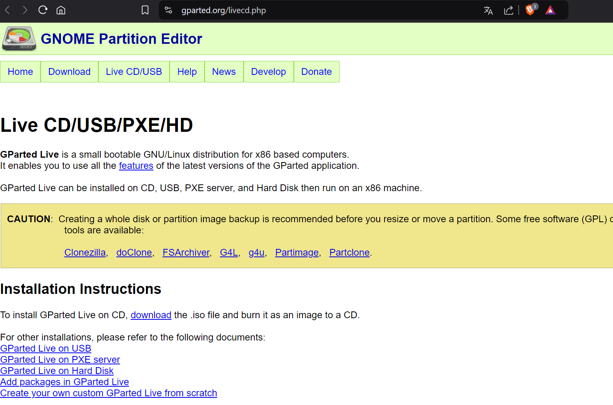
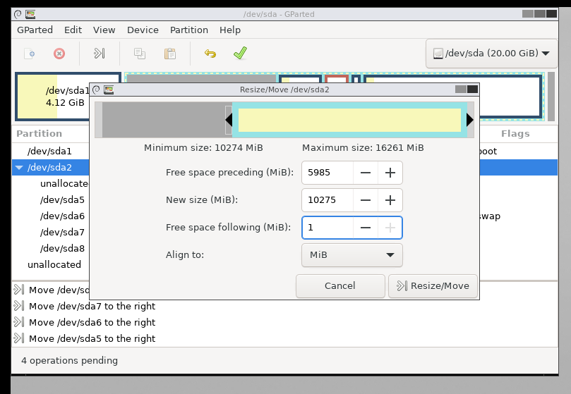
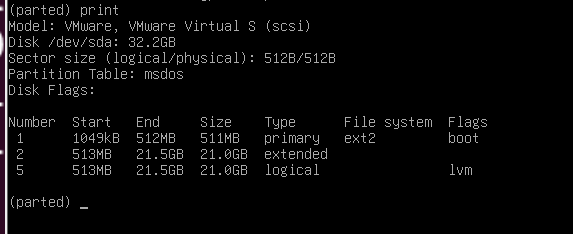

# Práctica 2 Laboratorio UNIX
# Jonathan Bautista Parra

## GParted

Lo primero que hice fue ir al siguiente link: https://gparted.org/livecd.php.

Di clic en **Downloads** y luego di clic en **Download gparted-live-1.6.0-10-amd64.iso**.

Me mandó a esta página y procedio la descarga.

Luego, encendí mi máquina virutal istalada en la práctica 1 sin LVM. Ejecuté los comandos **df -h** y **lsblk**.

Apagué la máquina y doy clic en **Devices**.

Me fui a **CD/DVD (IDE)** y seleccioné el iso correspondiente a **gparted**.

Guardé los cambios e incié la máquina virtual. 

Presioné **F2** para irme al SETUP.

Me fui a la opción **Boot** y puse **CD-ROM Drive** como primera opción.

Confirmé los cambios.

Una vez iniciado el instalador, seleccioné la primer opción.

Después, seleccioné **Don't touch keymap**.

Acepté las opciones por default de la instalación 

Ya inciado **Gparted** pude ver la información del disco.

La primera configuración que hice fue a **/dev/sda8**

La imagen muestra la ventana de "Resize/Move" (Redimensionar/Mover) en GParted para la partición /dev/sda8. En este cuadro de diálogo, se está ajustando el tamaño de la partición y la cantidad de espacio libre antes de ella.

Free space preceding (MiB): Se está configurando 5987 MiB de espacio libre antes de la partición /dev/sda8. Esto implica que la partición se moverá hacia la derecha, dejando espacio no asignado delante de ella.
New size (MiB): El nuevo tamaño de la partición se ha establecido en 7201 MiB. Esto indica que la partición se reducirá de su tamaño original para liberar espacio adicional.
Free space following (MiB): El valor es 0, lo que significa que no se dejará espacio libre después de la partición.

La configuración quedó de la siguiente manera: 

Una vez creado el nuevo espacio, modifiqué las particiones /dev/sda5, /dev/sda6, /dev/sda7 siguiendo los mismos pasos.

Luego modifiqué **/dev/sda2**

Asigné la cantidad de la barra azul correspondiente a /dev/sda2 al mismo nivel que la barra amarilla correspondiente a /dev/sda5.

Después de aplicar los cambios, asigné el espacio a /dev/sda1

Al aplicar los cambios, /dev/sda1 implementará el espacio libre al suyo. Pasando de pesar 4.12 GiB, a pesar 9.96 GiB.

Después de haber aplicado todos los cambios correspondientes, guardé todo dando clic en la palomita verde.

Cerré la ventana de GParted y me salí de la herramienta dando clic en el ícono de Exit. Seleccioné **shutdown**.

Volví a configurar los dispositivos en el BOOT.

Inicié la máquina y volví a ejecutar los comandos **df -h** y **lsblk**

## Configuración de discos con LVM (solo para VMs con LVM)

Primero me fui a las configuraciones de la MV Debian con LVM creada en la práctica pasada.

Expandí el disco a **30GB**.

Inicié la máquina virtual y ejecuté los comandos **df -h** y **lsblk**.

Ingresé como **root** e instalé **gparted**.

Ejecuté **apt update**

Instalé **e2fsprogs**

Ejecuté el comando **ls /sys/class/scsi_device/** para listar los dispositivos SCSI disponibles en el sistema.

Ejecuté el comando **echo 1 > /sys/class/scsi_device/2\\\:0\\\:0\\\:0/device/block/sda/device/rescan**. Esto le indica al sistema operativo que realice un "rescan" del dispositivo SCSI identificado por 32:0:0:0 y específicamente del disco sda. Esto es útil cuando has realizado cambios en la configuración del disco (por ejemplo, agregado espacio adicional a un disco virtual en un entorno como VMware) y quieres que el sistema detecte esos cambios sin reiniciar.

Ejecuté **/usr/sbin/gparted /dev/sda**.

Una vez dentro, esjecuté el comando **print** para mostrar la tabla de particiones actual del disco.

Ejecuté el comando resizepart 2 100% para intentar redimensionar la partición 2 (la extendida) para que ocupe el 100% del espacio disponible en el disco.

Volví a ejecutar **print** para ver los cambios.

  Ejecuté el comando **/usr/sbin/lvextend -l +100%FREE /dev/mapper/debian--vg-root** El comando está intentando expandir un volumen lógico (LV). Específicamente, busca aumentar el tamaño del LV denominado /dev/mapper/debian--vg-root hasta ocupar todo el espacio libre (100%FREE) disponible en el grupo de volúmenes (VG).

Finalmente ejecuto **/usr/sbin/resize2fs /dev/mapper/debian--vg-root**: Este es el comando principal. Se está intentando redimensionar el sistema de archivos ubicado en el dispositivo de bloque /dev/mapper/debian--vg-root. Este dispositivo, como vimos antes, es un volumen lógico (LV) manejado por LVM.

resize2fs 1.47.0 (5-Feb-2023): Esta línea muestra la versión de la herramienta resize2fs que se está utilizando.

The filesystem is already 1056768 (4k) blocks long. Nothing to do!: Este mensaje es el resultado de ejecutar el comando. Indica que el sistema de archivos ya tiene el tamaño máximo posible, por lo que no se realizaron cambios.

