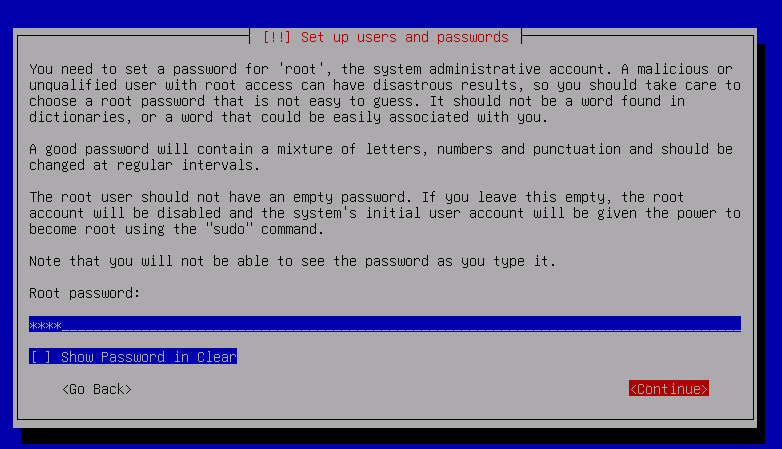
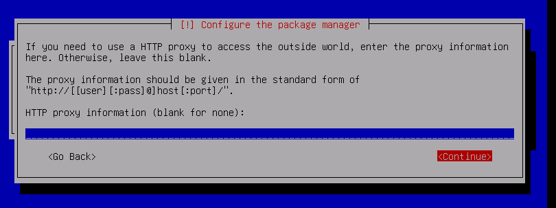
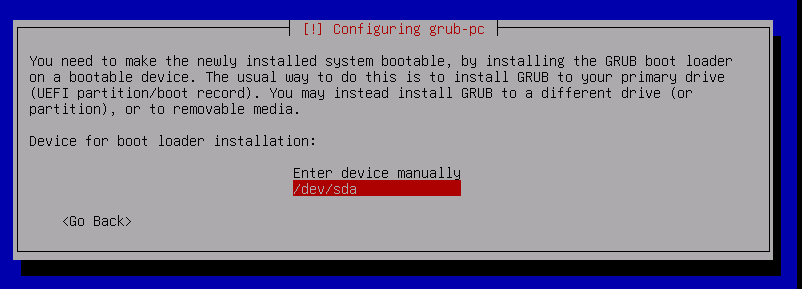

# Práctica 1 Laboratorio UNIX
# Jonathan Bautista Parra

## Instalar VMware
El vmware ya lo tenía instalado, por lo que no hubo necesidad de hacer la instalación. 

## Instalación de Debian sin LVM y particiones ad-hoc

Lo primero que hice fue ir a la página oficial de Debian

Di clic en descargar para descargar el iso. Una vez descargado el .iso, abrí el VMWare, me fui a **File** y luego a **New Virtual Machine**

Di clic en next

Seleccioné la opción **Installer disc image file(iso)** y busqué el iso de debian que descargué. Di clic en next.

Seleccióne el sistema operativo **Linux** y la verisón más reciente de Debian que aparecía en VMWare. Di clic en next.

Le asigné el nombre de **Debian12**. Di clic en next.

Le asigné un espacio de disco de 20GB y seleccioné la opción **Split virtual disk in multiple files**. Di clic en next.

Di clic en finish.

Una vez lista la máquina, di clic en **Power on this virtual machine**

Una vez iniciado el instalador, seleccioné la opción de **installar**.

Seleccioné el idioma inglés.

Seleccioné la opción **other**

Seleccioné la opción **México**

Seleccioné **United States** para el idioma

Seleccioné **American English** como Keymap

Le asigné el nombre de **debian** al host y seleccioné la opción **Continue**.

Dejé vació el campo de **Domain name** y seleccioné **Continue**.

Ingresé y verifiqué la contraseña para el usuario **root**. Seleccioné **Continue** en ambos casos.

Hice las configuraciones pertinentes para la creación de usuario no root. 

Seleccioné la zona horaria **central**

Seleccioné el método de partición **Guided - use entire disk**

Seleccioné la única opción disponible.

Como esquema de partición seleccioné **separate /home, /var, and /etc partitions**.

Escribí los cambios en el disco

Puse que no quería escanear otros medios de instalación

**Relalicé las configuaciones para el manejador de paquetes.**

Seleccioné el software para web server, ssh y utilerias del sistema estándar

Realicé las configuraciónes del grub-pc

Finalicé la instalación

Comprobé que el sistema se instaló correctamente iniciando sesión con el usuario creado.

## Instalar Linux con LVM y particiones ad-hoc
Le asigné el nombre de **Debian12LVM**

Seguí casi los mismos pasos hasta antes de las configuraciones de partición.

Para el método de partición seleccioné **Guided - use entire disk and set up LVM**

Realicé las siguientes configuraciónes para la partición del disco

Para las configuraciones del **package manager** hice lo siguiente: 

Seleccioné ssh y utilidades estándar de sistema.

Para el **grub-pc** elegí las siguientes opciones:

Finalicé la instalación y comprobé que se haya instalado correctamente iniciando sesión con el usuario creado.

