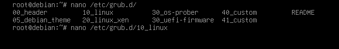

# Laboratorio Práctica 3
# Jonathan Bautista Parra

## Shell de root desde el bootloader

Primero inicié la máquina virtual Debian12 y cuando apareció el GRUB, presioné la tecla *e* para ingresar al menú de edición de las entradas del GRUB.

Una vez dentro, ingreso **init=/bin/sh** para especificar qué programa debe ejecutarse como proceso de inicialización (PID 1) durante el arranque. 

Presioné **Ctrl+x**

Ingresé el comando **mount** para mostrar una lista de todos los sistemas de archivos montados en ese momento.

Ejecuté el comando **mount -o remount,rw :/** para volver a montar el sistema de archivos raíz / con permisos de lectura y escritura. Después ejecuté el comando **mount**.

Luego, ejecuté el comando **passwd** para tener una nueva contraseña.

Reinicié el sistema y abrí el archivo **/etc/grub.d/10_linux** usando **nano** y siendo usuario root.

Me fui a la línea 132 y agregué **--unrestricted** antes de la etiqueta ${CLASS} para hacerla accesible sin restricciones.

Despues de haber guardado los cambios, ejecuté el comando  **pdate-grub**.

## Protección con Contraseña de GRUB

Ingresé como usuario root. Luego ejecuté el comando **grub-mkpasswd-pbkdf2** para generar una contraseña cifrada para usar en la configuración de GRUB.

Posteriormente, ingresé al archivo **/etc/grub.d/40_custom** usando nano.

Agregué el usuario **root** y la contraseña cifrada generada anteriormente. Una vez guardados los cambios, volví a ejecutar **update-grub**.

Reinicié el sistema para asegurarme que, al momento de que inicie el sistema, será de forma normal, pidiendo nuestro usuario y contraseña.

Finalmente, volví a reiniciar al sistema para intentar ingresar al menú de edición de las entradas del GRUB y verificar que ahora se piden las credenciales configuradas anteriormente.

