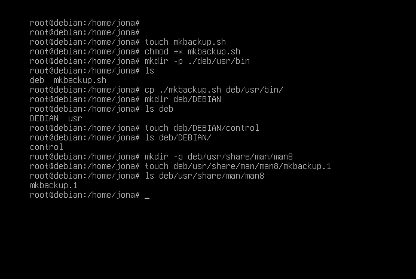
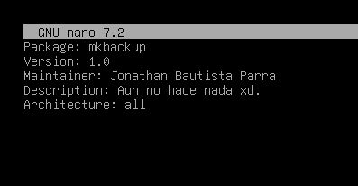
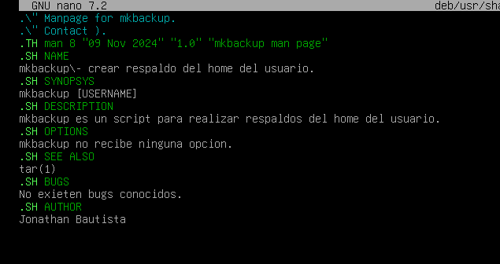
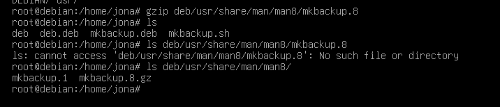
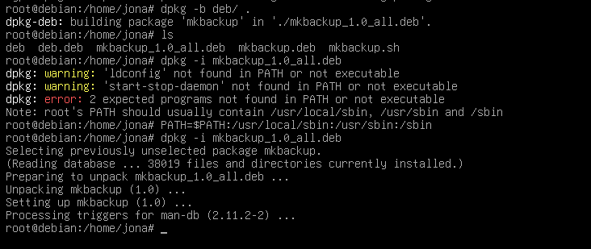
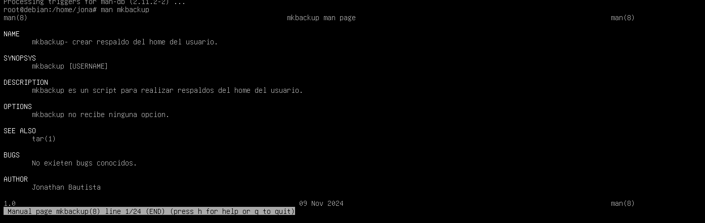

# Laboratorio Práctica 4

# Jonathan Bautista Parra

## Comandos previos de deb:

Lo primero que hice fue inicar la máquina virtual Debian12 e iniciar sesón como usuario root.
Después, creé el archivo **mkbackup.sh** usando **touch** y le asigné permisos de ejecución con **chmod +x mkbackup.sh**

Luego, creé los directorio **deb/DEBIAN**, **deb/usr/bin** y **deb/usr/share/man/man8** con ayuda de **mkdir**

También creeé los archivos **deb/DEBIANcontrol**, **deb/usr/share/man/man8/mkbackup.8** y copié el archivo **mkbackup.sh** a **deb/usr/bin**.
Nota: se muestra que creé el archivo **mkbackup.1**, pero después creé **mkbackup.8**.

El contenido que ingresé a  **deb/DEBIANcontrol** fue el siguiente:

El contenido que ingresé a **deb/usr/share/man/man8/mkbackup.8** fue el siguiente:

Posteriormente, comprimí el archivo **deb/usr/share/man/man8/mkbackup.8** usando **gzip**.

Ejecuté **dpkg -b deb/ .** para crear un paquete .deb a partir del contenido del directorio deb/ en el directorio actual.

Ejecuté **sudo dpkg -i mkbackup_1.0_all.deb** para instalar el paquete .deb llamado mkbackup_1.0_all.deb en el sistema.

Finalmente, ejecuté **man mkbackup** para mostrar la página de manual del comando mkbackup.

