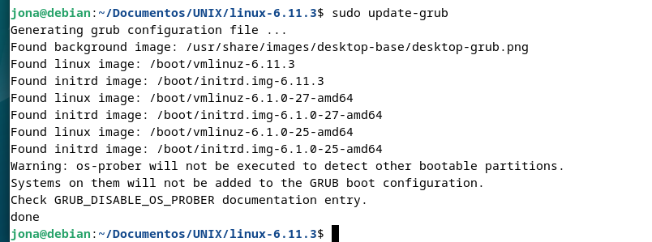

# Práctica 5 Laboratorio UNIX
# Jonathan Bautista Parra
## Actualizar el Kernel de linux

Lo primero que hice fue instalar las dependencias necesarias. Para ello ejecuté **sudo apt update** y **sudo apt install build-essential libncurses-dev bison flex libssl-dev libelf-dev bc dwarves -y**

Después, creé una carpeta para guardar el kernel. Descargué la versión **6.11.3** usando **wget** y lo descomprimí usando **tar**.

Me fui a la carpeta generada al descomprimir el archivo.

Para la configuración del kernel, primero copie el archivo de configuración **/boot/config-$(uname -r)** a la carpeta y le asigné el nombre de **.config**.
Esto para simplificar el proceso de compilación, ya que es el archivo de configuración del kernel actual.

Ejecuté **make menuconfig** para la configuración del nuevo kernel.

Cargué y guardé los cambios.

Compilé el kernel utilizando todos los núcleos de CPU disponibles usando el comando **make -j$(nproc)**

Una vez compilado el kernel sin errores,ejecuté **sudo make modules_install** para instalar los módulos seleccionados en la configuración para  usar como módulos extra por el kernel. 

Instalé el kernel usando el comando **sudo make install**

Actualicé el cargador de arranque y reinicié la máquina virtual. Para ello ejecuté **sudo update-brub** y **sudo reboot**-

Finalmente, ejecuté **uname -r** para mostrar la neuva versión del kernel.

