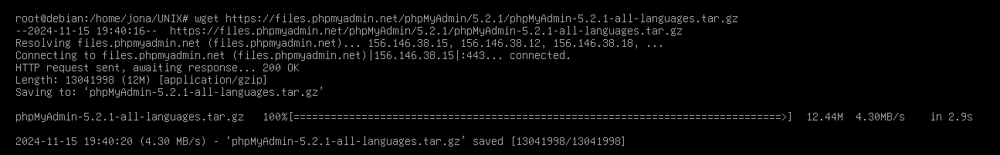

# Práctica 5 Laboratorio UNIX
# Jonathan Bautista Parra
## phpMyAdmin

Lo primero que hice fue ejecutar **apt update** para actualizar la caché del gestor de paquetes.

Luego, ejecuté **apt install apache2** para intentar instalar apache, aunque ya lo tenía instalado.

Instalé el servidor de base de datos MariaDB, el cual es un sistema de gestión de bases de datos derivado de MySQL.

Después, ejecuté **mysql_secure_installation** para configurar la seguridad del servidor MariaDB.

Inicé una sesión en la consola de MariaDB para corroborar que se instaló correctamente.

Ejecuté **apt install php libapache2-mod-php php-mysql** para instalar PHP y las bibliotecas necesarias para que PHP funcione con Apache y MariaDB.

Ejecuté **nano /etc/apache2/mods-enabled/dir.conf** para abrir  el archivo de configuración de Apache relacionado con los módulos habilitados, específicamente para la directiva de orden de indexación de directorios.
Moví el archivo index.php a la primera posición después de la especificación DirectoryIndex.

Guardé los cambios. Luego, recargué la configuración de Apache sin detener el servidor usando **systemctl reload apache2** y mostré el estado de apache ejecutando **systemctl status apache2**.

## Instalación de phpMyAdmin y paquetes recomendados

Para esta parte, primero instalé las extensiones adicionales de PHP necesarias para el funcionamiento de phpMyAdmin. Para esto ejecuté **apt install php-mbstring php-zip php-gd**.

Unas instaladas las extensiones, descargué el código fuente de la versión  más reciente de **phpmyadmin.**

Una vez descargado el código fuente, lo descomprimí usando **tar -xvf phpMyAdmin-5.2.1-all-languages.tar.gz**

Ejecuté el comando **mv phpMyAdmin-4.9.7-all-languages/ /usr/share/phpmyadmin** para mover el directorio phpMyAdmin-4.9.7-all-languages y todos sus subdirectorios al directorio /usr/share/.

Ejecué **sudo mkdir -p /var/lib/phpmyadmin/tmp** para crear un directorio temporal para phpMyAdmin. Este directorio es necesario para almacenar archivos temporales que phpMyAdmin pueda necesitar.

Después ejecuté **chown -R www-data:www-data /var/lib/phpmyadmin** para cambiar el propietario del directorio temporal a www-data, el usuario con el que corre Apache y así garantizar que phpMyAdmin pueda acceder y manipular los archivos en el directorio.

Copié el archivo de configuración de ejemplo de phpMyAdmin a un archivo de configuración real

Instalé la herramienta pwgen,utilizada para generar contraseñas aleatorias.

Ejecuté **pwgen -s 32 1** para generar una cadena segura de 32 caracteres para ser utilizada como valor para blowfish_secret.

