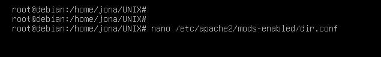

# Práctica 5 Laboratorio UNIX
# Jonathan Bautista Parra
## phpMyAdmin

Lo primero que hice fue ejecutar **apt update** para actualizar la caché del gestor de paquetes.

Luego, ejecuté **apt install apache2** para intentar instalar apache, aunque ya lo tenía instalado.

Instalé el servidor de base de datos MariaDB, el cual es un sistema de gestión de bases de datos derivado de MySQL.

Después, ejecuté **mysql_secure_installation** para configurar la seguridad del servidor MariaDB.

Inicé una sesión en la consola de MariaDB para corroborar que se instaló correctamente.

Ejecuté **apt install php libapache2-mod-php php-mysql** para instalar PHP y las bibliotecas necesarias para que PHP funcione con Apache y MariaDB.

Ejecuté **nano /etc/apache2/mods-enabled/dir.conf** para abrir  el archivo de configuración de Apache relacionado con los módulos habilitados, específicamente para la directiva de orden de indexación de directorios.
Moví el archivo index.php a la primera posición después de la especificación DirectoryIndex.

Guardé los cambios. Luego, recargué la configuración de Apache sin detener el servidor usando **systemctl reload apache2** y mostré el estado de apache ejecutando **systemctl status apache2**.

