# Práctica 7 Laboratorio UNIX
# Jonathan Bautista Parra
## Fail2ban ClamaV Postfix y Logwatch

Lo primero que hice fue ejecutar **sudo apt install aptitude**.

Luego, ejecuté **sudo aptitude update** para actualizar los índices de los repositorios de paquetes usando aptitude.

Luego, Instalé el paquete fail2ban usando el gestor de paquetes aptitude.

Cambié el directorio de trabajo al de configuración de Fail2Ban (/etc/fail2ban) y creé una copia de jail.conf con el nombre jail.local. Este archivo (jail.local) es donde se recomienda hacer modificaciones personalizadas de Fail2Ban.

Abrí el archivo jail.local en el editor de texto nano con permisos de superusuario para hacer ajustes para hacer las configuraciones pertinentes.

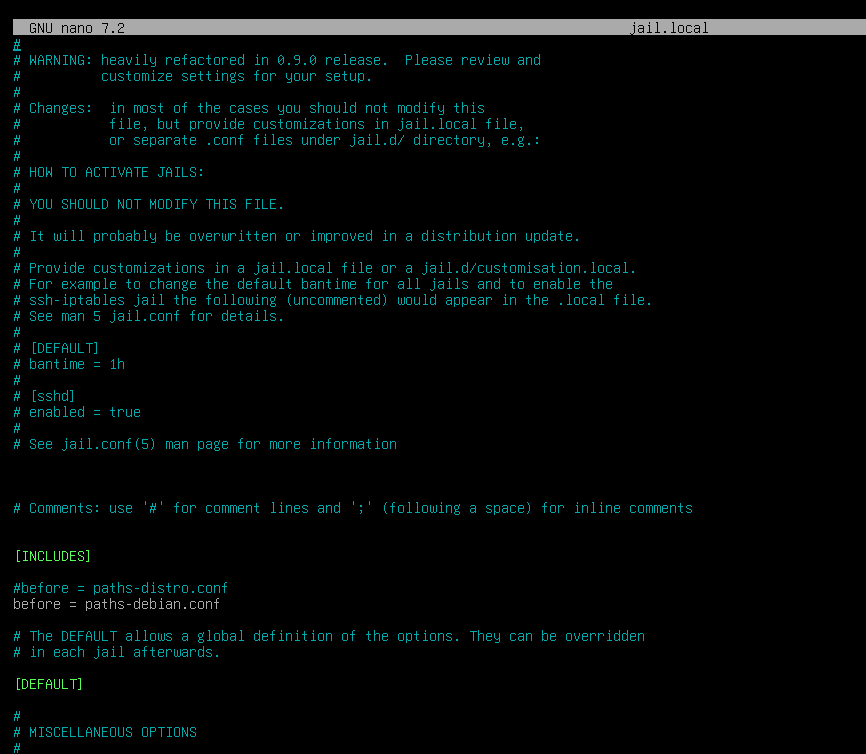
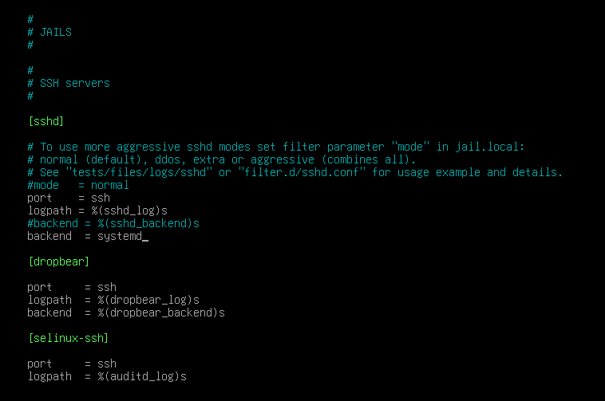

Me cambié a mi directorio personal, reinicié el servicio Fail2Ban para aplicar cualquier cambio hecho en el archivo de configuración (jail.local) y verifiqué su estado.

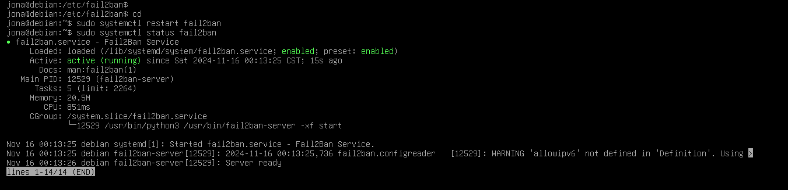

Consulté el estado del filtro de Fail2Ban para el servicio SSHD, mostrando estadísticas como IPs bloqueadas y tiempo de los bloqueos.

Bloquée una ip, revisé el estado, la desbloqueé y volví a revisar el estado.

 Reinicié el servicio Fail2Ban, asegurando que cualquier cambio o ajuste adicional se haya aplicado correctamente.

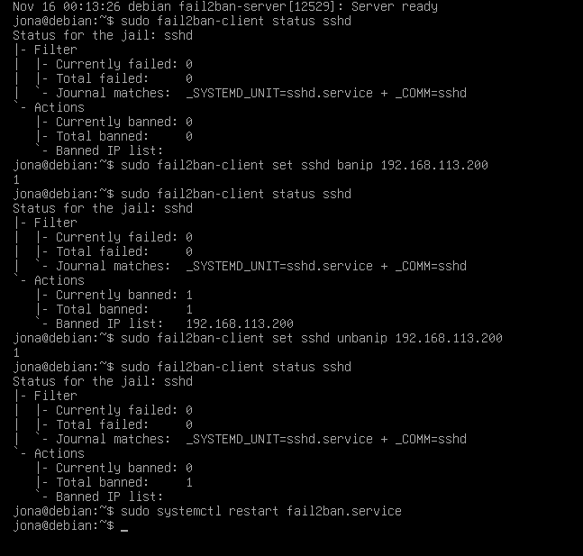

## ClamaV

Instalé el antivirus ClamAV y su servicio clamav-daemon

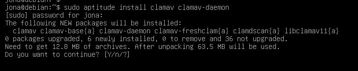

Reconfiguré el paquete clamav-daemon aceptando las opciones que traía por defecto.

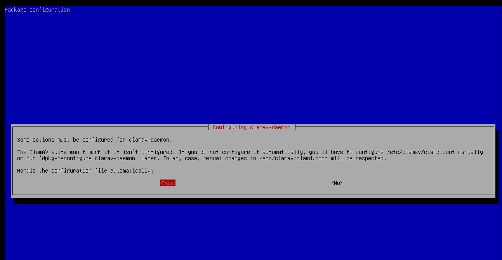
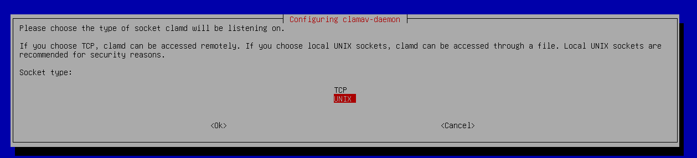

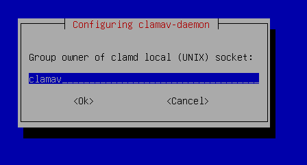
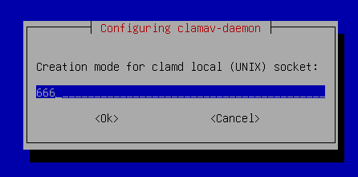
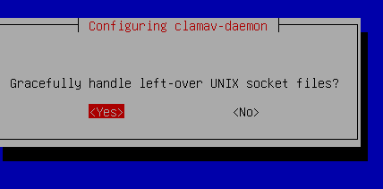
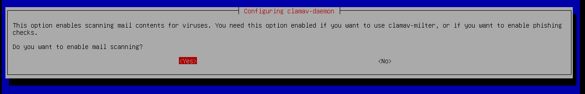

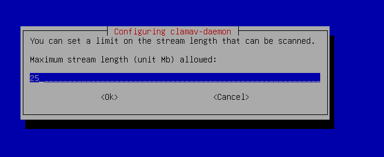
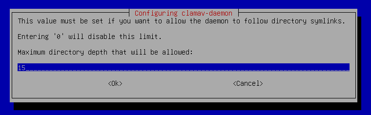
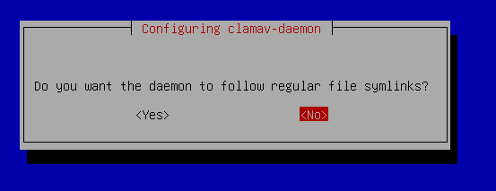
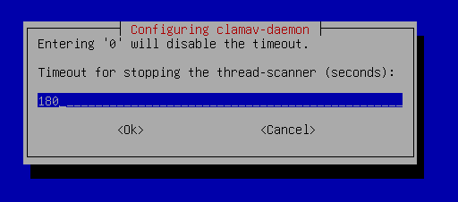

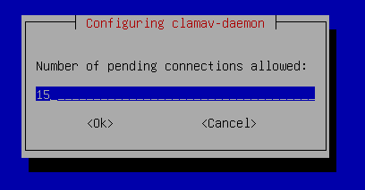

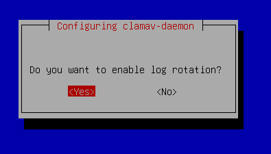
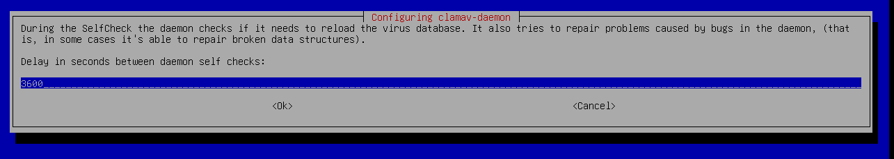
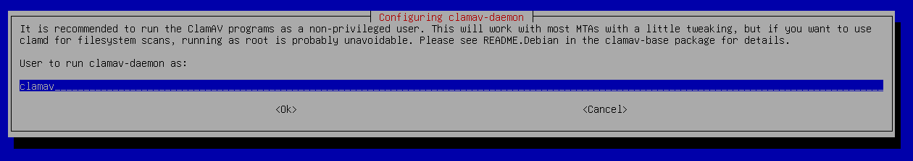
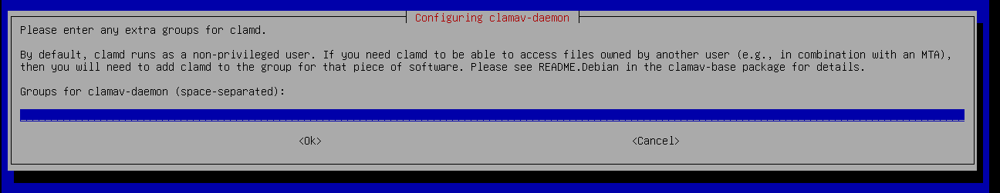
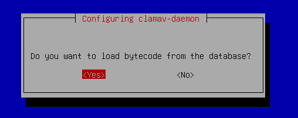
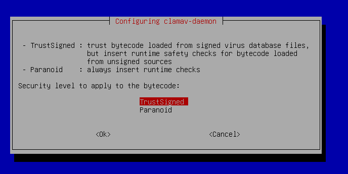
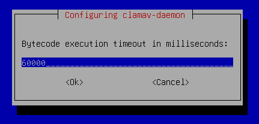

