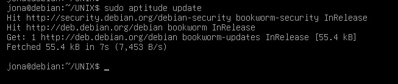
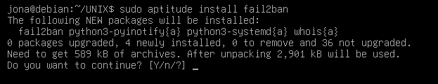

# Práctica 7 Laboratorio UNIX
# Jonathan Bautista Parra
## Fail2ban ClamaV Postfix y Logwatch

Lo primero que hice fue ejecutar **sudo apt install aptitude**.

Luego, ejecuté **sudo aptitude update** para actualizar los índices de los repositorios de paquetes usando aptitude.

Luego, Instalé el paquete fail2ban usando el gestor de paquetes aptitude.

