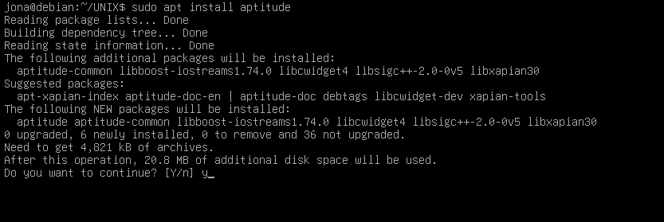
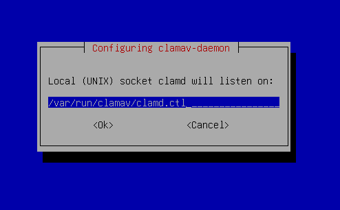
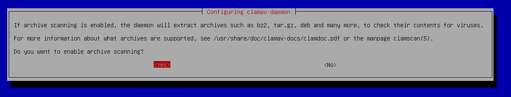
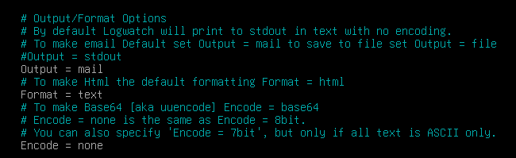

# Práctica 7 Laboratorio UNIX
# Jonathan Bautista Parra
## Fail2ban ClamaV Postfix y Logwatch

Lo primero que hice fue ejecutar **sudo apt install aptitude**.

Luego, ejecuté **sudo aptitude update** para actualizar los índices de los repositorios de paquetes usando aptitude.

Luego, Instalé el paquete fail2ban usando el gestor de paquetes aptitude. Para ello ejecuté **sudo aptitude install fail2ban**.

Cambié el directorio de trabajo al de configuración de Fail2Ban (/etc/fail2ban) y creé una copia de jail.conf con el nombre jail.local. Este archivo (jail.local) es donde se recomienda hacer modificaciones personalizadas de Fail2Ban. Para esto ejecuté **cd /etc/fail2ban** y **sudo cp jail.conf jail.local**.

Abrí el archivo jail.local en el editor de texto nano con permisos de superusuario para hacer ajustes para hacer las configuraciones pertinentes.

Me cambié a mi directorio personal, reinicié el servicio Fail2Ban para aplicar cualquier cambio hecho en el archivo de configuración (jail.local) y verifiqué su estado.
**cd** , **sudo systemctl restart fail2ban** y **sudo systemctl status fail2ban**.

Consulté el estado del filtro de Fail2Ban para el servicio SSHD, mostrando estadísticas como IPs bloqueadas y tiempo de los bloqueos.

Bloquée una ip, revisé el estado, la desbloqueé y volví a revisar el estado.

 Reinicié el servicio Fail2Ban, asegurando que cualquier cambio o ajuste adicional se haya aplicado correctamente.

## ClamaV

Instalé el antivirus ClamAV y su servicio clamav-daemon **( sudo aptitude install clamav clamav-daemon )**

Reconfiguré el paquete clamav-daemon aceptando las opciones que traía por defecto. **( sudo dpkg-reconfigure clamav-daemon )**.

Verifiqué el estado del servicio clamav-freshclam ejecutando **sudo systemctl status clamav-freshclam.service**.

Ejecuté **sudo systemctl enable clamav-freshclam.service** para activar el servicio clamav-freshclam para que se inicie automáticamente al arrancar el sistema e inicié el servicio clamav-freshclam.

Creaé el archivo de script clamavscan.sh en el directorio de tareas diarias. Para ello ejecuté **sudo nano /etc/cron.daily/clamavscan.sh**.

Ejecuté el comando clamscan sobre el directorio /home/

Ejecuté **sudo chmod +x /etc/cron.daily/clamavscan.sh** para asignar permisos de ejecución al script clamavscan.sh para que el sistema pueda ejecutarlo automáticamente cada día. Luego ejecuté dicho script.

## Postfix y Logwatch

Ejecuté **sudo aptitude install mailutils postfix logwatch** para instalar algunos paquetes necesarios.

Después, ejecuté **sudo dpkg-reconfigure postfix** para reconfigurar postfix (usé los valores por defecto).

Ejecuté **sudo nano /etc/aliases** para configurar alias de correo, que redirigen correos enviados a cuentas del sistema (por ejemplo, root) a direcciones de correo reales.

Actualicé la base de datos de alias ejecutando **sudo newaliases**.

Ejecuté **sudo mkdir /var/cache/logwatch** para crear un directorio de caché para Logwatch.

Luego, ejecuté **sudo cp /usr/share/logwatch/default.conf/logwatch.conf /etc/logwatch/conf/** para copiar el archivo de configuración principal de Logwatch (logwatch.conf) al directorio de configuración en /etc/logwatch.

Ejecuté **sudo nano /etc/logwatch/conf/logwatch.conf** para abrir el archivo logwatch.conf y ajustar las siguientes configuraciones.

Ejecuté Logwatch manualmente para generar un informe de baja profundidad (--detail Low) sobre la actividad de hoy (--range today).

con **sudo cat /var/mail/root | head -n 30** mostré las primeras 30 líneas del contenido del buzón de correo de root.

Abrí el archivo de tareas diarias 00logwatch con **sudo nano /etc/cron.daily/00logwatch**. 

Para las tareas semanales, copié el archivo entrior a **/etc/cron.weekly/00logwatch** con **sudo cp /etc/cron.daily/00logwatch /etc/cron.weekly/00logwatch**.

Finalmente, en el archivo **/etc/logwatch/conf/logwatch.conf** cambié el rango para hacerlo semanal. Para ello, a la variable **Range** le asigné el valor **between -7 days and -1 days**.

